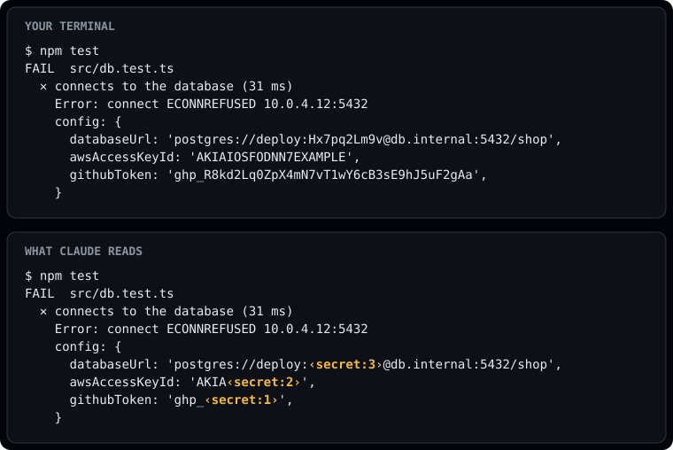

# secret-mask

Masks secrets in tool output, file reads and prompts before Claude reads them. Claude sees
`‹secret:1›`, and your screen still shows the real value.



A `PreToolUse` hook could only block that command. This lets it run and masks the output.

Tested with Claude Code 2.1.288. Function hooks are early access, so a later release may break it.

## Install

```bash
claude plugin marketplace add mashabek/claude-mods
claude plugin install secret-mask@claude-mods
```

## Commands

| | |
|---|---|
| `/secret-mask` | Status, which files were read, and what was masked. Never prints a value. |
| `/secret-mask on`, `off` | Turns masking on or off. Remembered across sessions. |
| `/secret-mask rescan` | Rereads secret files after you edit a `.env`. |

The status line shows `🔒 3 masked` once something has been masked.

## What it masks

- Values from the project's `.env` files, `~/.aws/credentials`, `~/.npmrc`, `~/.netrc`,
  `~/.pgpass`, and environment variables named like `*_TOKEN`, `*_SECRET` or `*_PASSWORD`,
  wherever they show up, including URL-encoded and base64 copies.
- GitHub, GitLab, AWS, Anthropic, OpenAI, Stripe, Slack, Google, npm and SendGrid tokens, JWTs,
  private keys, `Authorization` headers, and passwords in `user:pass@host` URLs.
- Token-like values assigned to secret names, like `apiKey = "..."` or `SESSION_SECRET=...`.

Commit hashes, UUIDs, paths, `process.env.X` and placeholders like `${DB_PASS}` are left alone.
It makes no network or model calls and has no dependencies. Values are only held in memory.
The whole thing is about 320 lines in [`hooks/`](hooks), with 23 tests.

## Limits

- A secret with no known format, no secret-looking name and no copy in a local file gets through.
- Some attachments Claude Code builds per request can't be rewritten by plugins.
- Secrets Claude saw before the plugin loaded stay in its context.
